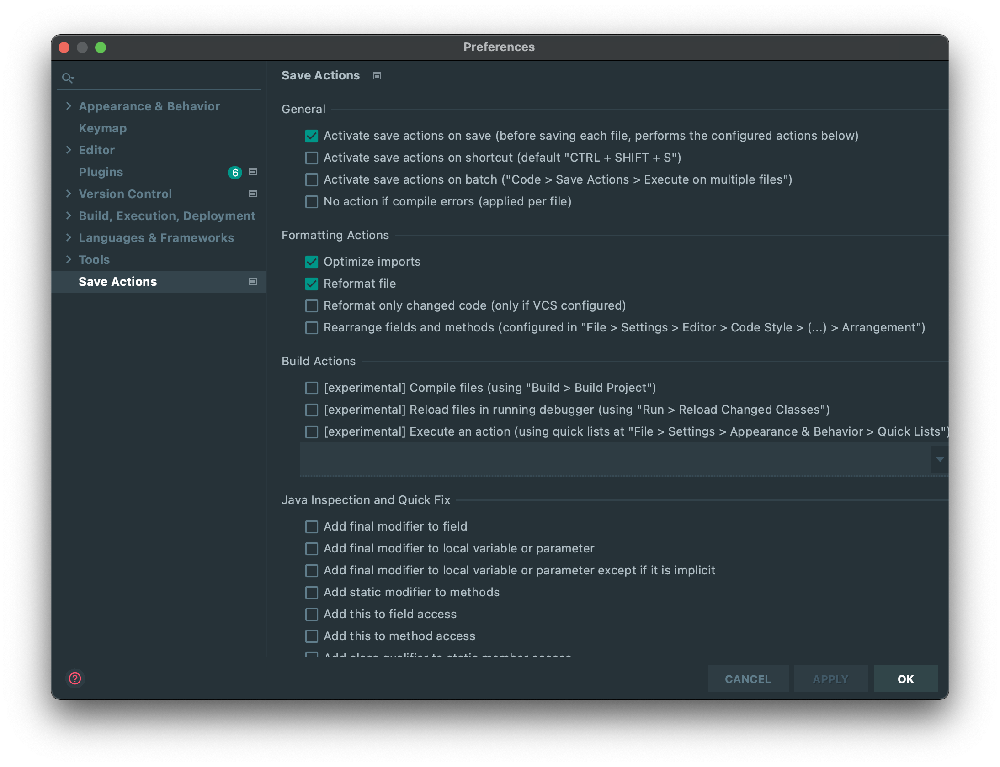
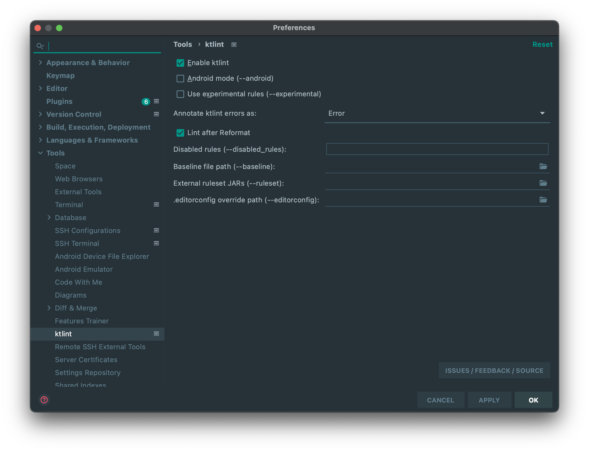

# [『코틀린으로 배우는 함수형 프로그래밍』](https://blog.insightbook.co.kr/2019/12/12/코틀린으로-배우는-함수형-프로그래밍/)

## 초기 셋팅

[`./Makefile`](./Makefile) 참고

```shell
make
```

## Kotlin 개발환경 셋팅 (IntelliJ)

### 플러그인 설치

- [SonarLint 플러그인](https://plugins.jetbrains.com/plugin/7973-sonarlint)
- [Kotest 플러그인](https://plugins.jetbrains.com/plugin/14080-kotest)
- [Kotlin 플러그인](https://plugins.jetbrains.com/plugin/6954-kotlin)
- [Save Actions 플러그인](https://plugins.jetbrains.com/plugin/7642-save-actions)
    1. Preferences -> Save Actions 에서 아래와 같이 체크
        - 
- [Ktlint 플러그인](https://plugins.jetbrains.com/plugin/15057-ktlint-unofficial-)
    1. Preferences -> Tools -> ktlint -> Enable Ktlint 체크
        - 

## TODO

- Kover 적용
    - https://github.com/Kotlin/kotlinx-kover
    - https://blog.jetbrains.com/kotlin/2021/11/kotlin-1-6-0-is-released/#kover
